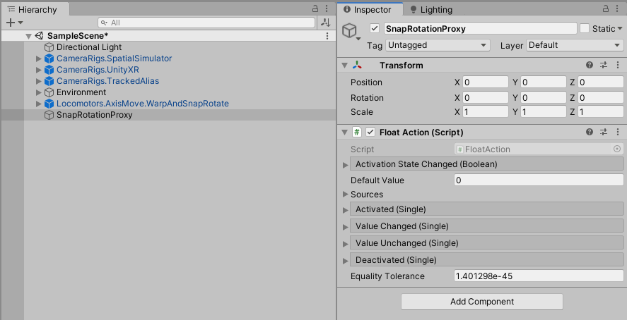
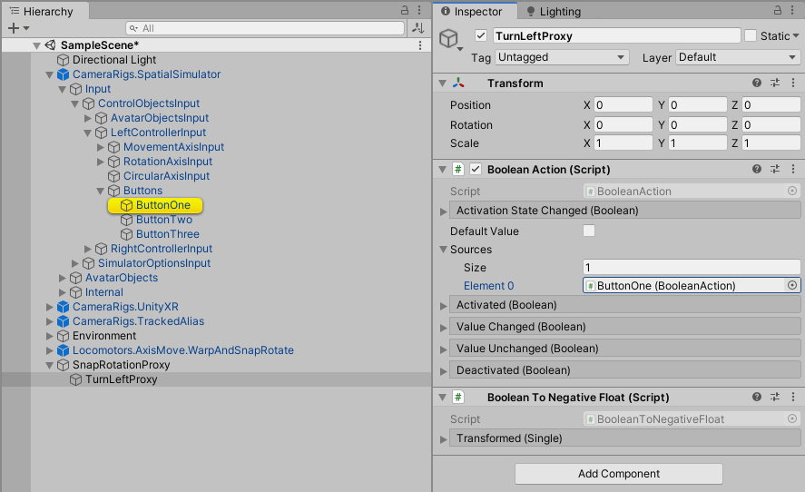

# Adding A Camera SnapRotator

> * Level: Beginner
>
> * Reading Time: 10 minutes
>
> * Checked with: Unity 2019.4.0f1

## Introduction

The Camera SnapRotator warps the main camera instantly left/right with a camera fade between each movement and snap rotates by 45 degrees each rotation around the Y axis when clicking the left/right mouse button. The camera fades between each rotation.

This is useful if you want to give a player the possibility to turn quickly around.

The outcome of this How-To Guide is to learn how to add the SnapRotator prefab to the scene and utilize the custom actions to provide the input for the rotation. For better testing in the Editor, this how-To guide wraps BooleanActions into a FloatAction. When using controller prefabs and the corresponding ThumbStickMovement, the wrapping is not needed. Instead the FloatActions of the MovementAxisInput on the HorizontalAxis can be used directly, as this is a FloatAction.

## Prerequisites

* [Add the Tilia.CameraRigs.SpatialSimulator.Unity](https://github.com/ExtendRealityLtd/Tilia.CameraRigs.SpatialSimulator.Unity/blob/master/Documentation/HowToGuides/AddingASpatialSimulatorCameraRig/README.md) prefab to the scene Hierarchy.
* [Add the Tilia.CameraRigs.UnityXR](https://github.com/ExtendRealityLtd/Tilia.CameraRigs.UnityXR/blob/master/Documentation/HowToGuides/AddingAUnityXRCameraRig/README.md) prefab to the scene Hierarchy.
* [Add the Tilia.CameraRigs.TrackedAlias.Unity](https://github.com/ExtendRealityLtd/Tilia.CameraRigs.TrackedAlias.Unity/blob/master/Documentation/HowToGuides/AddingATrackedAlias/README.md) prefab to the scene Hierarchy.
* [Install the Tilia.Locomotors.AxisMove.Unity](https://github.com/FireDragonGameStudio/Tilia.Locomotors.AxisMove.Unity/blob/master/Documentation/HowToGuides/Installation/README.md) package dependency in to your Unity project.

## Let's Start

### Step 1

Expand the `Tilia Locomotors AxisMove Unity` Package directory in the Unity Project window and select then `Packages -> Tilia Locomotors AxisMove Unity -> Runtime -> Prefabs` directory then drag and drop the `Locomotors.AxisMove.WarpAndSnapRotate` prefab into the Hierarchy window.

### Step 2

Create an empty gameobject, rename it to `SnapRotationProxy` and add a `FloatAction` component to it.

### Step 3

Create a new script, name it `BooleanToNegativeFloat` and add the following code:

'''
using System;
using UnityEngine.Events;
using Zinnia.Data.Type.Transformation;

/// 

/// Transforms a boolean value to the equivalent float value.
/// 

/// <example>
/// false = 0f
/// true = -1f
/// </example>
public class BooleanToNegativeFloat : Transformer<bool, float, BooleanToNegativeFloat.UnityEvent> {
    /// 

    /// Defines the event with the transformed <see cref="float"/> value.
    /// 

    [Serializable]
    public class UnityEvent : UnityEvent<float> {
    }

    /// 

    /// Transforms the given input bool to the float equivalent value.
    /// 

    /// <param name="input">The value to transform.</param>
    /// <returns>The transformed value.</returns>
    protected override float Process(bool input) {
        return input ? -1f : 0f;
    }
}
'''

### Step 4

Add an empty child object to `SnapRotationProxy` and name it `TurnLeftProxy`. Add `BooleanAction` and `BooleanToNegativeFloat` components to it.

### Step 4
