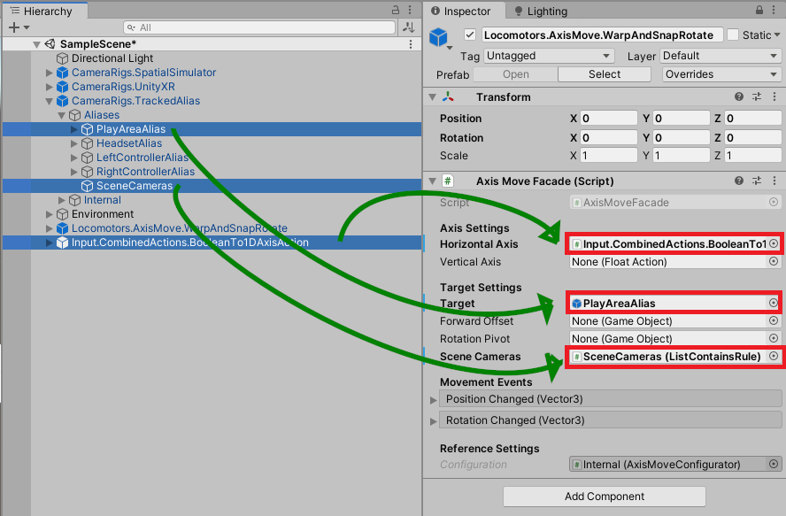

# Adding A Camera SnapRotator

> * Level: Beginner
>
> * Reading Time: 10 minutes
>
> * Checked with: Unity 2019.4.0f1

## Introduction

The Camera SnapRotator warps the main camera instantly left/right with a camera fade between each movement and snap rotates by 45 degrees each rotation around the Y axis when triggering an action, like moving the thumbstick left/right. The camera fades between each rotation.

This is useful if you want to give a player the possibility to turn quickly around.

The outcome of this How-To Guide is to learn how to add the SnapRotator prefab to the scene and utilize the custom actions to provide the input for the rotation. For better testing in the Editor, this How-To guide connects `BooleanAction` with a `Input.CombinedActions.BooleanTo1DAxisAction`. When using controller prefabs and the corresponding ThumbStickMovement, the wrapping is not needed. Instead the `FloatActions` of the MovementAxisInput for the HorizontalAxis can be used directly.

## Prerequisites

* [Add the Tilia.CameraRigs.SpatialSimulator.Unity](https://github.com/ExtendRealityLtd/Tilia.CameraRigs.SpatialSimulator.Unity/blob/master/Documentation/HowToGuides/AddingASpatialSimulatorCameraRig/README.md) prefab to the scene Hierarchy.
* [Add the Tilia.CameraRigs.UnityXR](https://github.com/ExtendRealityLtd/Tilia.CameraRigs.UnityXR/blob/master/Documentation/HowToGuides/AddingAUnityXRCameraRig/README.md) prefab to the scene Hierarchy.
* [Add the Tilia.CameraRigs.TrackedAlias.Unity](https://github.com/ExtendRealityLtd/Tilia.CameraRigs.TrackedAlias.Unity/blob/master/Documentation/HowToGuides/AddingATrackedAlias/README.md) prefab to the scene Hierarchy.
* [Install the Tilia.Input.UnityInputManager.Unity](https://github.com/ExtendRealityLtd/Tilia.Input.UnityInputManager/tree/master/Documentation/HowToGuides/Installation) Package dependency in to your Unity project.
* [Install the Tilia.Input.CombinedActions.Unity](https://github.com/ExtendRealityLtd/Tilia.Input.CombinedActions.Unity/tree/adddocs/Documentation/HowToGuides/Installation) package dependency in to your Unity project.
* [Read the HowTo-Guide for using Combined Actions](https://github.com/ExtendRealityLtd/Tilia.Input.CombinedActions.Unity/blob/master/Documentation/HowToGuides/UsingCombinedActions/README.md) before, to understand how to use Boolean input such as keyboard keys to mimic an analogue axis such as a thumbstick.
* [Set up a TrackedAlias](https://github.com/ExtendRealityLtd/Tilia.CameraRigs.TrackedAlias.Unity/tree/master/Documentation/HowToGuides/AddingATrackedAlias) to get a working VR camera rig in the Editor.
* [Install the Tilia.Locomotors.AxisMove.Unity](https://github.com/FireDragonGameStudio/Tilia.Locomotors.AxisMove.Unity/blob/master/Documentation/HowToGuides/Installation/README.md) package dependency in to your Unity project.

## Let's Start

### Step 1

Expand the `Tilia Locomotors AxisMove Unity` Package directory in the Unity Project window and select then `Packages -> Tilia Locomotors AxisMove Unity -> Runtime -> Prefabs` directory then drag and drop the `Locomotors.AxisMove.WarpAndSnapRotate` prefab into the Hierarchy window.

### Step 2

Expand the `Tilia Input UnityInputManager Unity` package directory in the Unity Project window and select the `Packages -> Tilia Input UnityInputManager Unity -> Runtime -> Prefabs -> Actions` directory then drag and drop the `Input.CombinedActions.BooleanTo1DAxisAction` prefab into the Unity hierarchy window.

### Step 3

Locate `CameraRigs.SpatialSimulator -> Input -> ControlObjectsInput -> LeftControllerInput -> Buttons -> ButtonOne` and `CameraRigs.SpatialSimulator -> Input -> ControlObjectsInput -> LeftControllerInput -> Buttons -> ButtonTwo` inputs in the hierarchy.

### Step 4

Add an empty child object to `SnapRotationProxy` and name it `TurnLeftProxy`. Add `BooleanAction` and `BooleanToNegativeFloat` components to it. Drag a reference of gameobject `CameraRigs.SpatialSimulator -> Input -> ControlObjectsInput -> LeftControllerInput -> Buttons -> ButtonOne` into the `Sources` of the `BooleanAction` component. These represent the left and right mouse button in the Unity Editor. You can use any other inputs, e.g. the horizontal Thumbstick Axis from Oculus Touch controllers.

### Step 5

Select the Drag the `Input.CombinedActions.BooleanTo1DAxisAction` gameobject and drag `ButtonOne` on the `Negative Input` and `ButtonTwo` on the `Positive Input` fields.

### Step 6

Select `Locomotors.AxisMove.WarpAndSnapRotate` gameobject and add the references:

* `Horizontal Axis` -> `Input.CombinedActions.BooleanTo1DAxisAction`
* `Target`-> `CameraRigs.TrackedAlias-> Aliases -> PlayAreaAlias`
* `Scene Cameras` -> `CameraRigs.TrackedAlias-> Aliases -> SceneCameras`

### Done

Now you have a SnapRotator attached. Everytime you click the left mouse button your camera will rotate left by 45°. When pressing the right mouse button the camera will rotate right by 45°.

