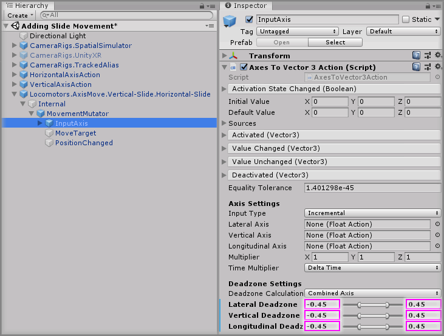

# Adding Slide Movement

> * Level: Beginner
>
> * Reading Time: 5 minutes
>
> * Checked with: Unity 2018.3.14f1

## Introduction

Slide movement is a form of locomotion that allows an object to move around a scene by smoothly gliding along the surface in a forward/backward or side strafing motion. We're going to implement this form of locomotion to move around a tracked alias with input from a controller thumbstick.

## Prerequisites

* [Add the Tilia.CameraRigs.TrackedAlias.Unity -> CameraRigs.TrackedAlias] prefab to the scene hierarchy.
* [Install the Tilia.Input.UnityInputManager] package dependency in to your [Unity] project.
* [Install the Tilia.Locomotors.AxisMove.Unity] package dependency in to your Unity project.

## Let's Start

### Step 1

Add a `Input.UnityInputManager.1DAxisAction` prefab to the Unity project hierarchy by selecting `GameObject -> Tilia -> Prefabs -> Input -> UnityInputManager -> Actions -> Input.UnityInputManager.1DAxisAction` from the Unity main top menu.

### Step 2

Rename the newly added `Input.UnityInputManager.1DAxisAction` GameObject in the Unity Hierarchy window to `HorizontalAxisAction`.

Select the `HorizontalAxisAction` GameObject from the Unity Hierarchy window and on the `Unity Input Manager Axis 1D Action` component change the `Axis Name` value to `Horizontal`.

> This will set up our 1D axis action to listen to the Unity Input Manager setting for the axis named `Horizontal` which usually correlates to the left/right axis on an Xbox Controller's left thumbstick or a VR left controller thumbstick/touchpad input. See the [Unity XR input map] guide for more details.

### Step 3

Duplicate the `HorizontalAxisAction` GameObject by right clicking on the `HorizontalAxisAction` GameObject and selecting `Duplicate` from the context menu then rename the duplicated `HorizontalAxisAction (1)` to `VerticalAxisAction`.

Select the `VerticalAxisAction` GameObject from the Unity Hierarchy window and on the `Unity Input Manager Axis 1D Action` component change the `Axis Name` value to `Vertical`.

> This will set up our second 1D axis action to listen to the Unity Input Manager setting for the axis named `Vertical` which usually correlates to the up/down axis on an Xbox Controller's left thumbstick or a VR left controller thumbstick/touchpad input.

### Step 4

Add a `Locomotors.AxisMove.Vertical-Slide.Horizontal-Slide` prefab to the Unity project hierarchy by selecting `GameObject -> Tilia -> Prefabs -> Locomotors -> AxisMove -> Locomotors.AxisMove.Vertical-Slide.Horizontal-Slide` from the Unity main top menu.

### Step 5

We now need to determine what actions control our slide locomotion and as we already have defined two Axis actions that work from our controller, we can simply just link those to the new slide prefab.

Drag and drop the `HorizontalAxisAction` GameObject into the `Horizontal Axis` property on the `Axis Move Facade` component on the `Locomotors.AxisMove.Vertical-Slide.Horizontal-Slide` GameObject.

Then drag and drop the `VerticalAxisAction` GameObject into the `Vertical Axis` property on the `Axis Move Facade` component on the `Locomotors.AxisMove.Vertical-Slide.Horizontal-Slide` GameObject.

### Step 6

We now need to decide what object to slide around the scene. If we want to control ourself as a form of locomotion then we can use the `CameraRigs.TrackedAlias` prefab elements to move ourself around.

Drag and drop the `CameraRigs.TrackedAlias -> Aliases -> PlayAreaAlias` GameObject into the `Target` property on the `Axis Move Facade` component on the `Locomotors.AxisMove.Vertical-Slide.Horizontal-Slide` GameObject.

This will move our play area around and therefore move us around.

We next need to decide on which direction we should move in the world if we press a certain direction on our input. For example, if we press up on the thumbstick then we should move forward in the world, but what way is forward? Is forward the direction we are looking (i.e. the direction of the headset) or do we want forward to be the direction that our controller is pointing so we can turn our head but still move forward?

This is what the `Forward Offset` property is for and it determines what GameObject we should use to determine our forward direction.

For this example, we'll just keep things simple and say we always walk forward in the direction that we are looking in, so we'll just use our `HeadsetAlias` GameObject for this.

Drag and drop the `CameraRigs.TrackedAlias -> Aliases -> HeadsetAlias` GameObject into the `Forward Offset` property on the `Axis Move Facade` component on the `Locomotors.AxisMove.Vertical-Slide.Horizontal-Slide` GameObject.

### Step 7

We're pretty much set up and ready to go now with this slide locomotion. However, if you play the Unity scene, you may find that the locomotion controls are a bit too sensitive with movement happening just when you rest your finger on your input device.

We can tweak this by delving into the `Locomotors.AxisMove.Vertical-Slide.Horizontal-Slide` prefab and adjusting some deadzone settings.

Select the `Locomotors.AxisMove.Vertical-Slide.Horizontal-Slide -> Internal -> MovementMutator -> InputAxis` GameObject from the Unity Hierarchy window and on the `Axes To Vector3 Action` component change the `Lateral Deadzone` property values to `-0.45` / `0.45`. Do the same with the `Vertical Deadzone` and `Longitudinal Deadzone` property values.

> This changes the input deadzone on the controller to only activate when the thumbstick or touchpad has been pushed up enough to be considered moving in a certain direction. You may wonder why this deadzone setting isn't on the top level facade and why it is nested away inside. Different axis locomotion mechanics have different input types and there is not one clean way of showing this deadzone information at the top level so sometimes it's necessary to delve into a prefab to make customizations.

### Done

Play the Unity scene and you will be able to slide your player around by pushing the thumbstick/touchpad on your input device.

[Add the Tilia.CameraRigs.TrackedAlias.Unity -> CameraRigs.TrackedAlias]: https://github.com/ExtendRealityLtd/Tilia.CameraRigs.TrackedAlias.Unity/tree/master/Documentation/HowToGuides/AddingATrackedAlias/README.md
[Install the Tilia.Input.UnityInputManager]: https://github.com/ExtendRealityLtd/Tilia.Input.UnityInputManager/tree/master/Documentation/HowToGuides/Installation/README.md
[Install the Tilia.Locomotors.AxisMove.Unity]: ../Installation/README.md 
[Unity]: https://unity3d.com/
[Unity XR input map]: https://docs.unity3d.com/2018.3/Documentation/Manual/xr_input.html