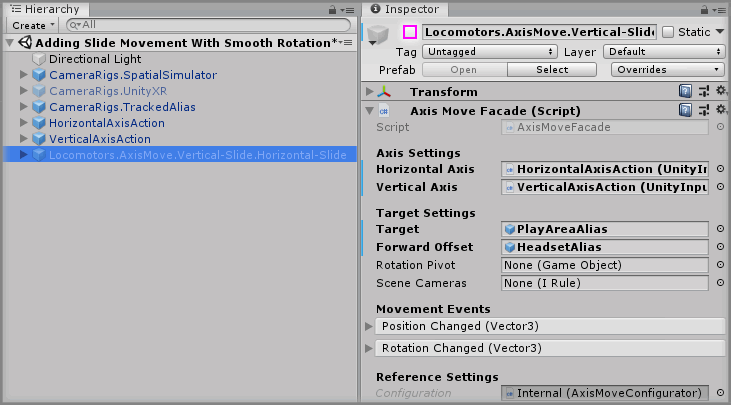
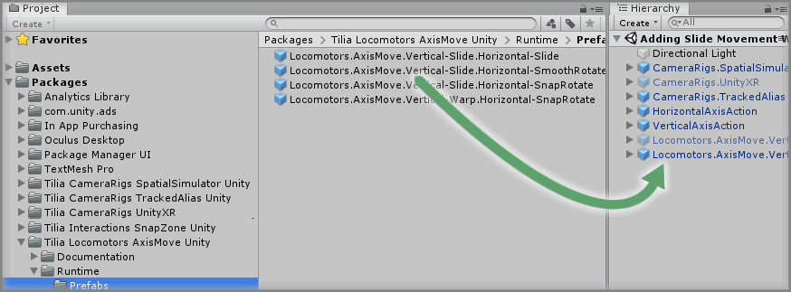
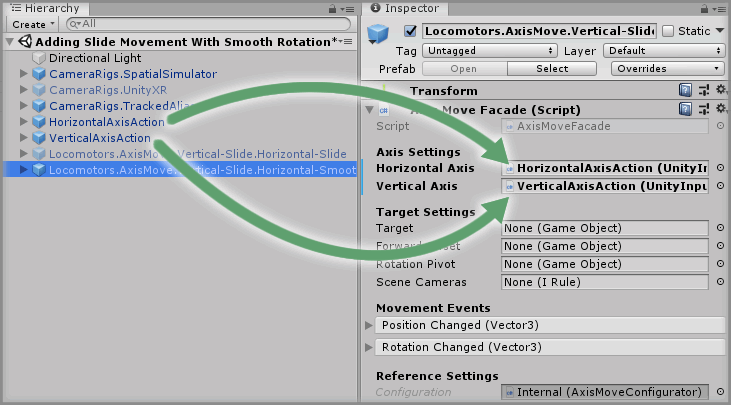
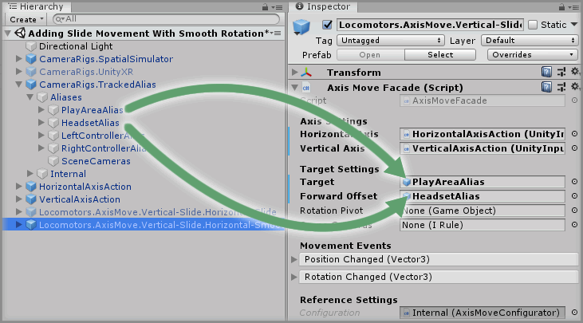
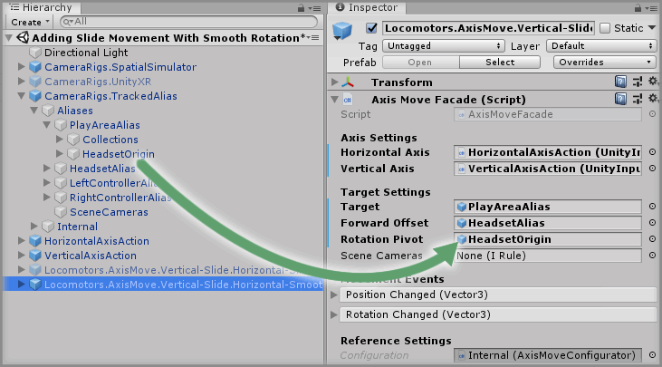

# Adding Slide Movement With Smooth Rotation

> * Level: Beginner
>
> * Reading Time: 5 minutes
>
> * Checked with: Unity 2018.3.14f1

## Introduction

We've already implemented a simple slide movement locomotion, but this simply moves us in the direction of our input. What if we also wanted to be able to rotate an object based on the input from a given axis? We can implement that again with a simple prefab that has been configured for forward/backward slide movement with a smooth rotation on the horizontal axis.

## Prerequisites

* Follow the [Adding Slide Movement] guide.

## Let's Start

### Step 1

We don't need the `Locomotors.AxisMove.Vertical-Slide.Horizontal-Slide` GameObject from the previous guide as the prefab we use in this guide will already give us the slide movement for forward and backward, so let's start off by disabling that GameObject.

Select the `Locomotors.AxisMove.Vertical-Slide.Horizontal-Slide` GameObject from the Unity hierarchy and disable the GameObject.

### Step 2

Expand the `Tilia Locomotors AxisMove Unity` Package directory in the Unity Project window and select the `Packages -> Tilia Locomotors AxisMove Unity -> Runtime -> Prefabs` directory then drag and drop the `Locomotors.AxisMove.Vertical-Slide.Horizontal-SmoothRotate` prefab into the Unity hierarchy window.

### Step 3

As with our other slide movement prefab, we can determine which axis input controls our movement and rotation.

Drag and drop the `HorizontalAxisAction` GameObject into the `Horizontal Axis` property on the `Axis Move Facade` component on the `Locomotors.AxisMove.Vertical-Slide.Horizontal-SmoothRotate` GameObject.

Then drag and drop the `VerticalAxisAction` GameObject into the `Vertical Axis` property on the `Axis Move Facade` component on the `Locomotors.AxisMove.Vertical-Slide.Horizontal-SmoothRotate` GameObject.

### Step 4

Again as with the previous guide, we need to determine what GameObject we want to move and the direction to consider as forward.

Drag and drop the `CameraRigs.TrackedAlias -> Aliases -> PlayAreaAlias` GameObject into the `Target` property on the `Axis Move Facade` component on the `Locomotors.AxisMove.Vertical-Slide.Horizontal-SmoothRotate` GameObject.

Drag and drop the `CameraRigs.TrackedAlias -> Aliases -> HeadsetAlias` GameObject into the `Forward Offset` property on the `Axis Move Facade` component on the `Locomotors.AxisMove.Vertical-Slide.Horizontal-SmoothRotate` GameObject.

### Step 5

We now have to set an additional property to deal with the rotational offset. This is because in a virtual reality environment, our headset is the position we are physically standing in our play area, but we are going to rotate our play area. The problem now occurs that if we rotate our play area and we're not standing in the physical centre of our play area then the world will look odd when it rotates around our view because our standing point is not the point of rotation.

To compensate for this, we can set a rotational pivot to change where we rotate the play area around, which is going to be our headset position. We cannot use the `HeadsetAlias` for this as the pivot point needs to be a child GameObject of our `PlayAreaAlias`, but we have a `HeadsetOrigin` GameObject that we can use instead.

Drag and drop the `CameraRigs.TrackedAlias -> Aliases -> PlayAreaAlias -> HeadsetOrigin` GameObject into the `Rotation Pivot` property on the `Axis Move Facade` component on the `Locomotors.AxisMove.Vertical-Slide.Horizontal-SmoothRotate` GameObject.

### Done

Play the Unity scene and you will be able to slide your player around by pushing the thumbstick/touchpad forward and backward on your input device, but if you push left or right then your player will smoothly rotate around.

[Adding Slide Movement]: ../AddingSlideMovement/README.md