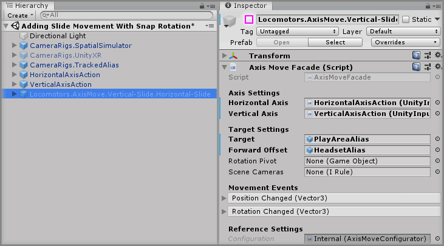

# Adding Slide Movement With Snap Rotation

> * Level: Beginner
>
> * Reading Time: 5 minutes
>
> * Checked with: Unity 2018.3.14f1

## Introduction

Another form of rotational locomotion is to snap the player to a new direction with an optional fade for comfort. We can implement this with a prefab already set up to handle smooth forward/backward sliding movement with a snap rotation on the horizontal axis.

## Prerequisites

* Follow the [Adding Slide Movement] guide.

## Let's Start

### Step 1

We don't need the `Locomotors.AxisMove.Vertical-Slide.Horizontal-Slide` GameObject from the previous guide as the prefab we use in this guide will already give us the slide movement for forward and backward, so let's start off by disabling that GameObject.

Select the `Locomotors.AxisMove.Vertical-Slide.Horizontal-Slide` GameObject from the Unity Hierarchy window and disable the GameObject.

### Step 2

Expand the `Tilia Locomotors AxisMove Unity` package directory in the Unity Project window and select the `Packages -> Tilia Locomotors AxisMove Unity -> Runtime -> Prefabs` directory then drag and drop the `Locomotors.AxisMove.Vertical-Slide.Horizontal-SnapRotate` prefab into the Unity Hierarchy window.

### Step 3

As with our other slide movement prefab, we can determine which axis input controls our movement and rotation.

Drag and drop the `HorizontalAxisAction` GameObject into the `Horizontal Axis` property on the `Axis Move Facade` component on the `Locomotors.AxisMove.Vertical-Slide.Horizontal-SnapRotate` GameObject.

Then drag and drop the `VerticalAxisAction` GameObject into the `Vertical Axis` property on the `Axis Move Facade` component on the `Locomotors.AxisMove.Vertical-Slide.Horizontal-SnapRotate` GameObject.

### Step 4

Again as with the previous guide, we need to determine what GameObject we want to move and the direction to consider as forward.

Drag and drop the `CameraRigs.TrackedAlias -> Aliases -> PlayAreaAlias` GameObject into the `Target` property on the `Axis Move Facade` component on the `Locomotors.AxisMove.Vertical-Slide.Horizontal-SnapRotate` GameObject.

Drag and drop the `CameraRigs.TrackedAlias -> Aliases -> HeadsetAlias` GameObject into the `Forward Offset` property on the `Axis Move Facade` component on the `Locomotors.AxisMove.Vertical-Slide.Horizontal-SnapRotate` GameObject.

### Step 5

We now have to set an additional property to deal with the rotational offset. This is because in a virtual reality environment, our headset is the position we are physically standing in our play area, but we are going to rotate our play area. The problem now occurs that if we rotate our play area and we're not standing in the physical centre of our play area then the world will look odd when it rotates around our view because our standing point is not the point of rotation.

To compensate for this, we can set a rotational pivot to change where we rotate the play area around, which is going to be our headset position. We cannot use the `HeadsetAlias` for this as the pivot point needs to be a child GameObject of our `PlayAreaAlias`, but we have a `HeadsetOrigin` GameObject that we can use instead.

Drag and drop the `CameraRigs.TrackedAlias -> Aliases -> PlayAreaAlias -> HeadsetOrigin` GameObject into the `Rotation Pivot` property on the `Axis Move Facade` component on the `Locomotors.AxisMove.Vertical-Slide.Horizontal-SnapRotate` GameObject.

### Step 6

We want to fade our camera view every time we snap rotate as this will reduce any potential nausea caused by such an instant snap movement. The prefab is already set up to fade but we just need to tell it which cameras to fade. We can simply use the `SceneCameras` component within our `TrackedAlias` to do this.

Drag and drop the `CameraRigs.TrackedAlias -> Aliases -> SceneCameras` GameObject into the `Scene Cameras` property on the `Axis Move Facade` component on the `Locomotors.AxisMove.Vertical-Slide.Horizontal-SnapRotate` GameObject.

### Step 7

We're pretty much ready to go now, the one last thing we may want to change is the amount of rotation that is applied per rotational snap. We'll need to delve into the prefab hierarchy again to get to this setting. By default this rotational snap setting is set to rotate us `45` degrees with every snap. Let's make it `30` degrees.

Select the `Locomotors.AxisMove.Vertical-Slide.Horizontal-SnapRotate -> Internal -> RotationMutator -> InputAxis` GameObject from the Unity Hierarchy window and on the `Axes To Vector3 Action` component change the `Multiplier` property value to `X: 1` `Y: 30` `Z: 1`.

> This changes the rotational multiplier of the `Y Axis` to `30`, which will now rotate us `30` degrees with every snap.

### Done

Play the Unity scene and you will be able to slide your player around by pushing the thumbstick/touchpad forward and backward on your input device, but if you push left or right then your player will snap rotate by `30` degrees and fade in and out with each rotation.

[Adding Slide Movement]: ../AddingSlideMovement/README.md